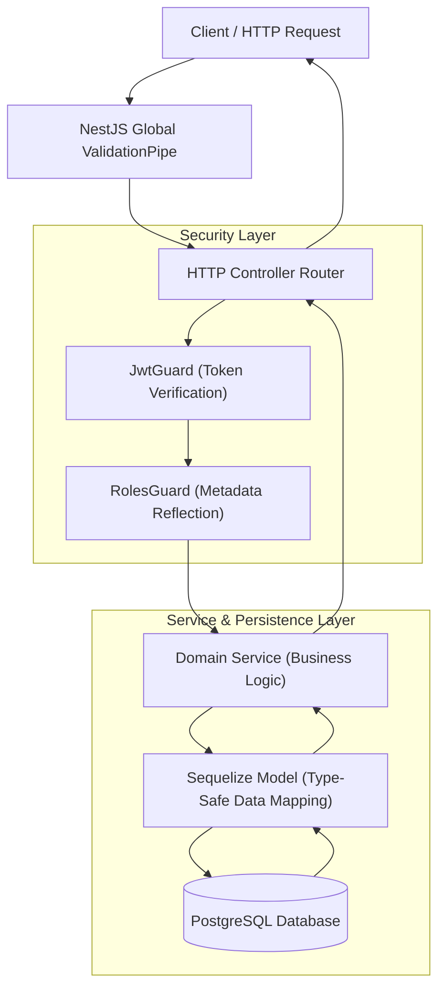
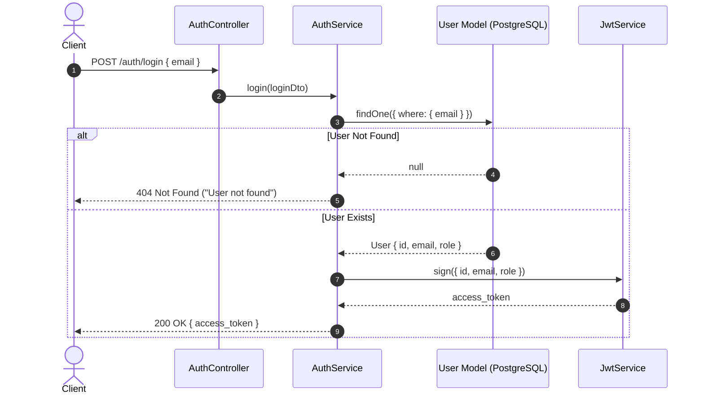
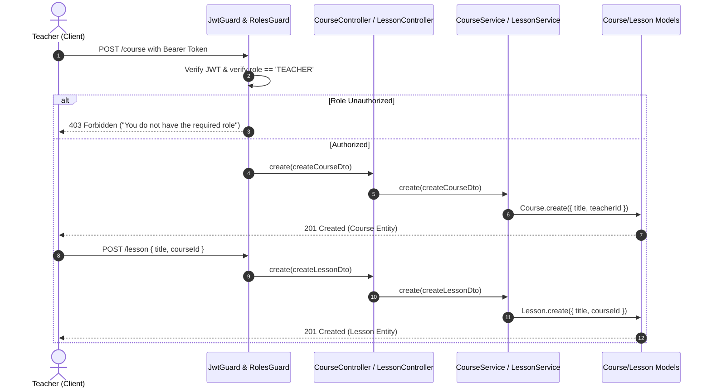
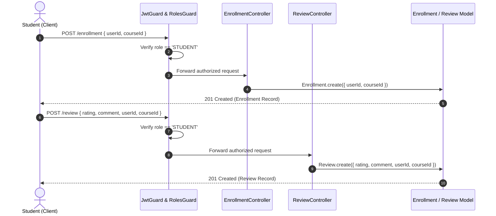
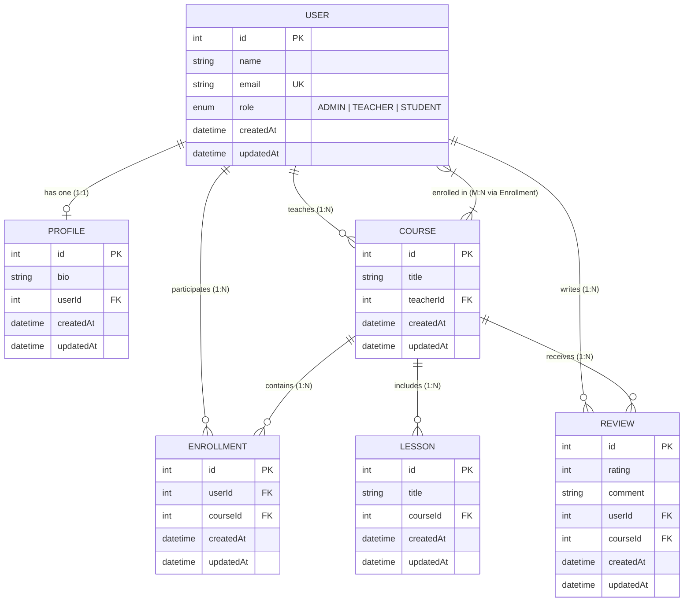

# Course Management System API

[](https://nestjs.com/)
[](https://www.typescriptlang.org/)
[](https://www.postgresql.org/)
[](https://sequelize.org/)
[](https://jwt.io/)
[](LICENSE)

A modular, enterprise-grade RESTful Course Management Backend API built with **NestJS**, **TypeScript**, and **Sequelize ORM** backed by **PostgreSQL**. The platform features Role-Based Access Control (RBAC), declarative data validation, and relational domain modeling covering user profiles, course catalogs, lesson schedules, student enrollments, and course reviews.

---

## Table of Contents

- [Overview](#overview)
- [Key Features](#key-features)
- [System Architecture](#system-architecture)
- [Important Workflows](#important-workflows)
- [Database Design & Relationships](#database-design--relationships)
- [Authentication & Access Control (RBAC)](#authentication--access-control-rbac)
- [Tech Stack](#tech-stack)
- [Project Structure](#project-structure)
- [API Reference](#api-reference)
- [Example Usage & API Flow](#example-usage--api-flow)
- [Installation & Setup](#installation--setup)
- [Database Configuration](#database-configuration)
- [Testing](#testing)
- [Engineering Highlights](#engineering-highlights)
- [Challenges & Solutions](#challenges--solutions)
- [Future Improvements](#future-improvements)

---

## Overview

The **Course Management System** provides a structured backend foundation for digital learning platforms. It solves the operational challenge of orchestrating multi-tiered academic interactions—allowing teachers to author curricula and publish lessons, students to enroll in courses and submit feedback, and administrators to govern system resources.

### Why This Project Is Interesting

- **Modular Domain Architecture**: Built on NestJS module patterns with loose coupling and high cohesion across bounded contexts (`User`, `Profile`, `Course`, `Lesson`, `Enrollment`, `Review`, `Auth`).
- **Strong Relational Modeling**: Leverages `sequelize-typescript` decorators to implement relational associations: 1-to-1 (`User` ↔ `Profile`), 1-to-Many (`Teacher` ↔ `Courses`, `Course` ↔ `Lessons`), and Many-to-Many (`Students` ↔ `Courses` via explicit `Enrollment` junction model).
- **Stateless RBAC Security**: Combines custom NestJS execution guards (`JwtGuard`, `RolesGuard`) and metadata reflection (`@Roles()`) to guard sensitive operations based on cryptographically signed tokens.
- **Strict Data Integrity**: Utilizes class-based Data Transfer Objects (DTOs) with `class-validator` and `ValidationPipe` to guarantee incoming payloads satisfy data constraints before reaching the business layer.

---

## Key Features

### Academic & Content Management
- **Course Lifecycle**: Instructors can create, query, update, and retire courses.
- **Curriculum & Lessons**: Structure course content with dedicated lesson entities tied directly to parent courses.
- **Student Enrollment Engine**: Students can enroll in courses with database-backed relational records.
- **Feedback & Review System**: Enrolled learners can rate and review courses with integer ratings and commentary.

### Role-Based Access Control (RBAC)
- **Three-Tier User Hierarchy**: Dedicated roles for `ADMIN`, `TEACHER`, and `STUDENT`.
- **Role Guards**: Execution guards enforce authorization boundaries (e.g., only teachers can publish courses/lessons, only students can enroll or review, only administrators can delete user accounts).
- **Stateless Token Verification**: Issues signed JSON Web Tokens (JWT) on login encoding claims (`id`, `email`, `role`).

### Data Layer & Validation
- **Declarative ORM Decorators**: Type-safe relational mappings via `sequelize-typescript`.
- **Auto-Sync Schema**: Automatically synchronizes entity definitions to PostgreSQL schema tables on boot.
- **Fail-Fast Request Validation**: Global NestJS `ValidationPipe` automatically validates and strips invalid fields using DTO decorators.

---

## System Architecture

The application adopts a layered architecture separating transport, security, business logic, and persistence concerns.



### Component Interaction Flow

1. **Request Ingestion**: Incoming requests hit the HTTP pipeline in [main.ts](file:///home/savan-kansagra/Desktop/practice/Advance%20Training/Course%20Management%20System/src/main.ts#L1-L10).
2. **Global Input Sanitization**: The global `ValidationPipe` evaluates incoming JSON against target DTOs (e.g., `CreateCourseDto`, `CreateUserDto`). If validation fails, an HTTP 400 response is returned immediately.
3. **Route Handling & Guards**: The target controller method inspects attached guards:
   - `JwtGuard` parses the `Bearer` token from the `Authorization` header, validates the signature via `JwtService`, and binds decoded claims to `request.user`.
   - `RolesGuard` reads role metadata declared by `@Roles(...)` via NestJS `Reflector` and ensures `request.user.role` matches the authorization policy.
4. **Service Execution**: Authorized calls invoke the corresponding domain service to execute database queries through Sequelize models.
5. **Persistence**: Queries execute against PostgreSQL, returning type-safe entity records.

---

## Important Workflows

### 1. Authentication & Token Issuance



### 2. Teacher Course & Curriculum Creation



### 3. Student Enrollment & Review Flow



---

## Database Design & Relationships

The relational model is designed using `sequelize-typescript` decorators to maintain relational integrity and clean foreign key constraints.



### Entity Associations in Code

| Relationship | Entities Involved | Sequelize Mapping | Description |
|---|---|---|---|
| **One-to-One (1:1)** | `User` ↔ `Profile` | `@HasOne(() => Profile)` / `@BelongsTo(() => User)` | A user possesses one personal bio profile (`userId` FK). |
| **One-to-Many (1:N)** | `User` ↔ `Course` | `@HasMany(() => Course, 'teacherId')` / `@BelongsTo(() => User, 'teacherId')` | An instructor authors multiple courses. |
| **One-to-Many (1:N)** | `Course` ↔ `Lesson` | `@HasMany(() => Lesson)` / `@BelongsTo(() => Course)` | A course contains multiple curriculum lessons (`courseId` FK). |
| **Many-to-Many (M:N)** | `User` ↔ `Course` | `@BelongsToMany(() => Course, () => Enrollment)` | Students enroll in multiple courses via the explicit `Enrollment` junction table. |
| **One-to-Many (1:N)** | `User` ↔ `Review` | `@HasMany(() => Review)` / `@BelongsTo(() => User)` | A user submits course ratings and feedback. |
| **One-to-Many (1:N)** | `Course` ↔ `Review` | `@HasMany(() => Review)` / `@BelongsTo(() => Course)` | A course aggregates reviews from enrolled students. |

---

## Authentication & Access Control (RBAC)

Security is implemented at the controller and route handler levels using custom NestJS guards:

### 1. Token Verification: [`JwtGuard`](file:///home/savan-kansagra/Desktop/practice/Advance%20Training/Course%20Management%20System/src/auth/jwt.guard.ts#L5-L30)
- Extracts the HTTP authorization header: `Authorization: Bearer <token>`.
- Validates the token against the registered JWT secret key (`super-secret-key`).
- Mounts decoded token payload (`id`, `email`, `role`) directly onto `request.user`.
- Rejects unauthenticated traffic with `401 Unauthorized` (`"No token provided"` or `"Invalid token"`).

### 2. Role-Based Access Control: [`RolesGuard`](file:///home/savan-kansagra/Desktop/practice/Advance%20Training/Course%20Management%20System/src/auth/roles.guard.ts#L5-L25)
- Uses NestJS `Reflector` to read metadata assigned by the custom [`@Roles(...)`](file:///home/savan-kansagra/Desktop/practice/Advance%20Training/Course%20Management%20System/src/auth/roles.decorator.ts#L4) decorator.
- If no roles are specified, the request passes through.
- If roles are required, checks `requiredRoles.includes(request.user.role)`.
- Rejects unauthorized users with `403 Forbidden` (`"You do not have the required role"`).

### Protected Operations Summary

```text
DELETE /user/:id        --> Required Role: ADMIN
POST   /course          --> Required Role: TEACHER
POST   /lesson          --> Required Role: TEACHER
POST   /enrollment      --> Required Role: STUDENT
POST   /review          --> Required Role: STUDENT
```

---

## Tech Stack

| Layer | Technology | Version | Purpose |
|---|---|---|---|
| **Framework** | [NestJS](https://nestjs.com/) | `^11.0.1` | Modular server-side application framework |
| **Runtime & Language** | [Node.js](https://nodejs.org/) & [TypeScript](https://www.typescriptlang.org/) | Node >= 20 / TS `^5.7.3` | Strongly-typed ECMAScript runtime (ES2023 target) |
| **Database** | [PostgreSQL](https://www.postgresql.org/) | `>= 14` | Relational ACID-compliant database |
| **ORM** | [Sequelize](https://sequelize.org/) | `^6.37.8` | Promise-based Node.js ORM |
| **ORM TypeScript Bindings** | [sequelize-typescript](https://github.com/RobinBuschmann/sequelize-typescript) | `^2.1.6` | Decorator-driven entity modeling |
| **NestJS Sequelize Adapter** | `@nestjs/sequelize` | `^11.0.1` | NestJS lifecycle integration for Sequelize |
| **Authentication** | `@nestjs/jwt` | `^11.0.2` | Token creation and verification utilities |
| **Validation** | `class-validator` & `class-transformer` | `^0.15.1` / `^0.5.1` | DTO schema validation and payload transformation |
| **Testing** | [Jest](https://jestjs.io/) & [Supertest](https://github.com/ladjs/supertest) | `^30.0.0` / `^7.0.0` | Unit and end-to-end HTTP integration testing |

---

## Project Structure

```text
course-management-system/
├── src/
│   ├── app.module.ts              # Root application module and Sequelize DB configuration
│   ├── main.ts                    # Bootstrap entry point with global ValidationPipe
│   ├── auth/                      # Authentication & authorization module
│   │   ├── auth.controller.ts     # Login route handler (/auth/login)
│   │   ├── auth.module.ts         # JwtModule registration & provider exports
│   │   ├── auth.service.ts        # User lookup & token signing logic
│   │   ├── jwt.guard.ts           # Bearer token verification guard
│   │   ├── roles.decorator.ts     # @Roles() metadata decorator
│   │   ├── roles.guard.ts         # Role assertion guard using Reflector
│   │   └── dto/
│   │       └── login.dto.ts       # Login request payload schema
│   ├── user/                      # User management module
│   │   ├── user.controller.ts     # CRUD routes for users (/user)
│   │   ├── user.model.ts          # User entity with Role enum & associations
│   │   ├── user.module.ts         # User module definition
│   │   ├── user.service.ts        # Database operations for User model
│   │   └── dto/
│   │       ├── create-user.dto.ts # User creation payload validation
│   │       └── update-user.dto.ts # Partial update DTO
│   ├── profile/                   # Learner profile module
│   │   ├── profile.controller.ts  # CRUD routes for user profiles (/profile)
│   │   ├── profile.model.ts       # Profile entity with 1:1 user foreign key
│   │   ├── profile.module.ts      # Profile module definition
│   │   ├── profile.service.ts     # Database operations for Profile model
│   │   └── dto/
│   │       ├── create-profile.dto.ts
│   │       └── update-profile.dto.ts
│   ├── course/                    # Course catalog module
│   │   ├── course.controller.ts   # CRUD routes for courses (/course)
│   │   ├── course.model.ts        # Course entity with teacher FK and relations
│   │   ├── course.module.ts       # Course module definition
│   │   ├── course.service.ts      # Database operations for Course model
│   │   └── dto/
│   │       ├── create-course.dto.ts
│   │       └── update-course.dto.ts
│   ├── lesson/                    # Curriculum lesson module
│   │   ├── lesson.controller.ts   # CRUD routes for lessons (/lesson)
│   │   ├── lesson.model.ts        # Lesson entity with course FK
│   │   ├── lesson.module.ts       # Lesson module definition
│   │   ├── lesson.service.ts      # Database operations for Lesson model
│   │   └── dto/
│   │       ├── create-lesson.dto.ts
│   │       └── update-lesson.dto.ts
│   ├── enrollment/                # Enrollment junction module
│   │   ├── enrollment.controller.ts # CRUD routes for enrollments (/enrollment)
│   │   ├── enrollment.model.ts    # Junction entity linking User and Course
│   │   ├── enrollment.module.ts   # Enrollment module definition
│   │   ├── enrollment.service.ts  # Database operations for Enrollment model
│   │   └── dto/
│   │       ├── create-enrollment.dto.ts
│   │       └── update-enrollment.dto.ts
│   └── review/                    # Course review and rating module
│       ├── review.controller.ts   # CRUD routes for reviews (/review)
│       ├── review.model.ts        # Review entity with rating and foreign keys
│       ├── review.module.ts       # Review module definition
│       ├── review.service.ts      # Database operations for Review model
│       └── dto/
│           ├── create-review.dto.ts
│           └── update-review.dto.ts
├── test/
│   ├── app.e2e-spec.ts            # End-to-end API test harness
│   └── jest-e2e.json              # E2E Jest configuration
├── nest-cli.json                  # Nest CLI configuration
├── package.json                   # Dependencies, scripts, and package metadata
├── tsconfig.json                  # TypeScript compiler configuration (NodeNext)
└── README.md                      # Project documentation
```

---

## API Reference

### 1. Authentication (`/auth`)

| Method | Endpoint | Description | Guard | Role Required | Request Body |
|---|---|---|---|---|---|
| `POST` | `/auth/login` | Authenticate user and issue JWT token | None (Public) | Any | `{ "email": "string" }` |

---

### 2. Users (`/user`)

| Method | Endpoint | Description | Guard | Role Required | Request Body / Params |
|---|---|---|---|---|---|
| `POST` | `/user` | Register a new user | None (Public) | None | `{ "name": "string", "email": "string", "role": "ADMIN" \| "TEACHER" \| "STUDENT" }` |
| `GET` | `/user` | Retrieve all users | None (Public) | None | None |
| `GET` | `/user/:id` | Retrieve user by ID | None (Public) | None | `id` (URL param) |
| `PATCH` | `/user/:id` | Update user details | None (Public) | None | Partial `{ name?, email?, role? }` |
| `DELETE` | `/user/:id` | Delete user record | `JwtGuard`, `RolesGuard` | **ADMIN** | `id` (URL param) |

---

### 3. Profiles (`/profile`)

| Method | Endpoint | Description | Guard | Role Required | Request Body / Params |
|---|---|---|---|---|---|
| `POST` | `/profile` | Create a profile for a user | None (Public) | None | `{ "bio": "string", "userId": number }` |
| `GET` | `/profile` | Retrieve all profiles | None (Public) | None | None |
| `GET` | `/profile/:id` | Retrieve profile by ID | None (Public) | None | `id` (URL param) |
| `PATCH` | `/profile/:id` | Update profile information | None (Public) | None | Partial `{ bio?, userId? }` |
| `DELETE` | `/profile/:id` | Delete profile record | None (Public) | None | `id` (URL param) |

---

### 4. Courses (`/course`)

| Method | Endpoint | Description | Guard | Role Required | Request Body / Params |
|---|---|---|---|---|---|
| `POST` | `/course` | Create a new course | `JwtGuard`, `RolesGuard` | **TEACHER** | `{ "title": "string", "teacherId": number }` |
| `GET` | `/course` | Retrieve all courses | None (Public) | None | None |
| `GET` | `/course/:id` | Retrieve course by ID | None (Public) | None | `id` (URL param) |
| `PATCH` | `/course/:id` | Update course details | None (Public) | None | Partial `{ title?, teacherId? }` |
| `DELETE` | `/course/:id` | Delete course record | None (Public) | None | `id` (URL param) |

---

### 5. Lessons (`/lesson`)

| Method | Endpoint | Description | Guard | Role Required | Request Body / Params |
|---|---|---|---|---|---|
| `POST` | `/lesson` | Add a lesson to a course | `JwtGuard`, `RolesGuard` | **TEACHER** | `{ "title": "string", "courseId": number }` |
| `GET` | `/lesson` | Retrieve all lessons | None (Public) | None | None |
| `GET` | `/lesson/:id` | Retrieve lesson by ID | None (Public) | None | `id` (URL param) |
| `PATCH` | `/lesson/:id` | Update lesson details | None (Public) | None | Partial `{ title?, courseId? }` |
| `DELETE` | `/lesson/:id` | Delete lesson record | None (Public) | None | `id` (URL param) |

---

### 6. Enrollments (`/enrollment`)

| Method | Endpoint | Description | Guard | Role Required | Request Body / Params |
|---|---|---|---|---|---|
| `POST` | `/enrollment` | Enroll student into a course | `JwtGuard`, `RolesGuard` | **STUDENT** | `{ "userId": number, "courseId": number }` |
| `GET` | `/enrollment` | Retrieve all enrollments | None (Public) | None | None |
| `GET` | `/enrollment/:id` | Retrieve enrollment by ID | None (Public) | None | `id` (URL param) |
| `PATCH` | `/enrollment/:id` | Update enrollment details | None (Public) | None | Partial `{ userId?, courseId? }` |
| `DELETE` | `/enrollment/:id` | Cancel/remove enrollment | None (Public) | None | `id` (URL param) |

---

### 7. Reviews (`/review`)

| Method | Endpoint | Description | Guard | Role Required | Request Body / Params |
|---|---|---|---|---|---|
| `POST` | `/review` | Submit review for a course | `JwtGuard`, `RolesGuard` | **STUDENT** | `{ "rating": number, "comment": "string", "userId": number, "courseId": number }` |
| `GET` | `/review` | Retrieve all reviews | None (Public) | None | None |
| `GET` | `/review/:id` | Retrieve review by ID | None (Public) | None | `id` (URL param) |
| `PATCH` | `/review/:id` | Update review details | None (Public) | None | Partial `{ rating?, comment?, userId?, courseId? }` |
| `DELETE` | `/review/:id` | Delete review record | None (Public) | None | `id` (URL param) |

---

## Example Usage & API Flow

Below is an end-to-end integration walkthrough using standard HTTP/cURL commands.

### Step 1: Register Users with Different Roles

Create a teacher, a student, and an administrator:

```bash
# Register Teacher
curl -X POST http://localhost:3000/user \
  -H "Content-Type: application/json" \
  -d '{
    "name": "Jane Instructor",
    "email": "jane.teacher@university.edu",
    "role": "TEACHER"
  }'

# Register Student
curl -X POST http://localhost:3000/user \
  -H "Content-Type: application/json" \
  -d '{
    "name": "Alex Student",
    "email": "alex.student@university.edu",
    "role": "STUDENT"
  }'

# Register Admin
curl -X POST http://localhost:3000/user \
  -H "Content-Type: application/json" \
  -d '{
    "name": "System Admin",
    "email": "admin@university.edu",
    "role": "ADMIN"
  }'
```

---

### Step 2: Authenticate and Acquire JWT Tokens

Log in to generate signed access tokens:

```bash
# Log in as Teacher
TEACHER_TOKEN=$(curl -s -X POST http://localhost:3000/auth/login \
  -H "Content-Type: application/json" \
  -d '{"email": "jane.teacher@university.edu"}' \
  | grep -o '"access_token":"[^"]*' | cut -d'"' -f4)

# Log in as Student
STUDENT_TOKEN=$(curl -s -X POST http://localhost:3000/auth/login \
  -H "Content-Type: application/json" \
  -d '{"email": "alex.student@university.edu"}' \
  | grep -o '"access_token":"[^"]*' | cut -d'"' -f4)
```

---

### Step 3: Publish a Course & Lessons (Teacher)

The teacher creates a course and populates it with syllabus lessons:

```bash
# Create Course (Protected: Requires TEACHER role)
curl -X POST http://localhost:3000/course \
  -H "Authorization: Bearer $TEACHER_TOKEN" \
  -H "Content-Type: application/json" \
  -d '{
    "title": "Distributed Systems with TypeScript",
    "teacherId": 1
  }'

# Response:
# {"id":1,"title":"Distributed Systems with TypeScript","teacherId":1,"updatedAt":"...","createdAt":"..."}

# Add Lessons
curl -X POST http://localhost:3000/lesson \
  -H "Authorization: Bearer $TEACHER_TOKEN" \
  -H "Content-Type: application/json" \
  -d '{
    "title": "Lesson 1: Introduction to RPC and Concurrency",
    "courseId": 1
  }'
```

---

### Step 4: Enroll in Course & Submit Review (Student)

The student enrolls in the course and submits feedback:

```bash
# Enroll Student (Protected: Requires STUDENT role)
curl -X POST http://localhost:3000/enrollment \
  -H "Authorization: Bearer $STUDENT_TOKEN" \
  -H "Content-Type: application/json" \
  -d '{
    "userId": 2,
    "courseId": 1
  }'

# Submit Review (Protected: Requires STUDENT role)
curl -X POST http://localhost:3000/review \
  -H "Authorization: Bearer $STUDENT_TOKEN" \
  -H "Content-Type: application/json" \
  -d '{
    "rating": 5,
    "comment": "In-depth explanations with real-world patterns.",
    "userId": 2,
    "courseId": 1
  }'
```

---

### Step 5: Authorization Enforcement Check

If a `STUDENT` attempts to perform a teacher-restricted action (such as creating a course), the `RolesGuard` rejects the request:

```bash
curl -i -X POST http://localhost:3000/course \
  -H "Authorization: Bearer $STUDENT_TOKEN" \
  -H "Content-Type: application/json" \
  -d '{
    "title": "Unauthorized Course",
    "teacherId": 2
  }'

# HTTP Response:
# HTTP/1.1 403 Forbidden
# {"message":"You do not have the required role","error":"Forbidden","statusCode":403}
```

---

## Installation & Setup

### Prerequisites

- **Node.js**: `v20.x` or higher
- **npm**: `v10.x` or higher
- **PostgreSQL**: `v14` or higher running locally on port `5432`

---

### Step-by-Step Installation

#### 1. Clone the Repository
```bash
git clone <repository-url>
cd "Course Management System"
```

#### 2. Install Dependencies
```bash
npm install
```

#### 3. Set Up PostgreSQL Database
Open your PostgreSQL shell (`psql`) or database GUI and create the target database:

```sql
CREATE DATABASE course_management_db;
```

Ensure a PostgreSQL user with appropriate credentials exists. The default configuration in `src/app.module.ts` connects with:
- **Host**: `localhost`
- **Port**: `5432`
- **User**: `postgres`
- **Password**: `Dev@1234`
- **Database**: `course_management_db`

#### 4. Run the Application

```bash
# Development mode with hot reload
npm run start:dev

# Production build and run
npm run build
npm run start:prod
```

The server initializes on port `3000`:
```text
[Nest] LOG [NestFactory] Starting Nest application...
[Nest] LOG [InstanceLoader] SequelizeModule dependencies initialized
[Nest] LOG [RoutesResolver] AuthController {/auth}:
[Nest] LOG [RouterExplorer] Mapped {/auth/login, POST} route
...
Application is running on: http://localhost:3000
```

---

## Database Configuration

The application uses `@nestjs/sequelize` configured in [src/app.module.ts](file:///home/savan-kansagra/Desktop/practice/Advance%20Training/Course%20Management%20System/src/app.module.ts#L13-L22):

```typescript
SequelizeModule.forRoot({
  dialect: 'postgres',
  host: 'localhost',
  port: 5432,
  username: 'postgres',
  password: 'Dev@1234',
  database: 'course_management_db',
  autoLoadModels: true,
  synchronize: true,
})
```

- **`autoLoadModels: true`**: Automatically loads and maps all models registered across imported feature modules without requiring manual entity arrays in the root module.
- **`synchronize: true`**: Synchronizes entity models directly with PostgreSQL schema definitions upon application startup.

> [!NOTE]
> For production environments, consider migrating credentials to environment variables using `@nestjs/config` and managing schema evolution via database migration scripts (e.g., Umzug or Sequelize CLI).

---

## Testing

The project uses [Jest](https://jestjs.io/) and [Supertest](https://github.com/ladjs/supertest) for testing.

### Test Configuration

- Unit test settings configured in `package.json` (`testRegex: ".*\\.spec\\.ts$"`).
- End-to-end test suite configured in [test/jest-e2e.json](file:///home/savan-kansagra/Desktop/practice/Advance%20Training/Course%20Management%20System/test/jest-e2e.json) with test harness in [test/app.e2e-spec.ts](file:///home/savan-kansagra/Desktop/practice/Advance%20Training/Course%20Management%20System/test/app.e2e-spec.ts).

### Running Tests

```bash
# Run unit tests
npm run test

# Run tests in watch mode
npm run test:watch

# Run end-to-end integration tests
npm run test:e2e

# Generate test coverage report
npm run test:cov
```

---

## Engineering Highlights

1. **Idiomatic NestJS Module Boundaries**:
   Each domain resource is encapsulated within its own module containing a dedicated Controller, Service, Model, and DTO layer. This enables independent maintenance and testing.

2. **Type-Safe Declarative ORM Mapping**:
   Instead of raw SQL or untyped schema strings, `sequelize-typescript` decorators (`@Table`, `@Column`, `@ForeignKey`, `@BelongsTo`, `@HasMany`, `@BelongsToMany`) maintain strict compile-time type safety for complex relational graphs.

3. **Decoupled Security via Interceptors & Guards**:
   Authorization logic is isolated from controller handlers. Endpoints declare security constraints declaratively using `@UseGuards(JwtGuard, RolesGuard)` and `@Roles(Role.TEACHER)`, keeping route handlers focused purely on HTTP parameter orchestration.

4. **Fail-Fast DTO Validation Pipeline**:
   Payloads are parsed and validated by NestJS's `ValidationPipe` before reaching services. Class validators (`@IsNotEmpty()`, `@IsEmail()`, `@IsEnum()`, `@IsNumber()`) guard domain models against corrupt or malformed inputs.

5. **Strict NodeNext ECMAScript Modules**:
   TypeScript is configured with `module: "nodenext"` and `moduleResolution: "nodenext"`, aligning the repository with modern Node.js standards.

---

## Challenges & Solutions

### Challenge 1: Granular Role-Based Access Control without Controller Bloat
- **Problem**: Different HTTP endpoints require distinct authorization rules (e.g., anyone can browse courses, only teachers can publish courses, only students can enroll, only admins can delete users). Hardcoding role checks inside service methods causes logic leakage and code duplication.
- **Solution**: Implemented a reusable `@Roles(...)` metadata decorator combined with a centralized `RolesGuard` powered by NestJS `Reflector`.
- **Result**: Route security is applied declaratively at the controller method level, separating authorization rules from business logic.

---

### Challenge 2: Modeling Complex Multi-Table Relational Associations
- **Problem**: A learning management system features diverse relationship types: 1-to-1 (`User` to `Profile`), 1-to-Many (`Course` to `Lesson`), and Many-to-Many (`Student` to `Course`). An untyped ORM configuration can cause incorrect foreign key bindings and silent schema drift.
- **Solution**: Leveraged `sequelize-typescript` to explicitly define foreign key attributes and association decorators, including an explicit `Enrollment` junction model for the Many-to-Many student-course relationship.
- **Result**: PostgreSQL schemas reflect exact referential integrity constraints, and query models expose type-safe association accessors.

---

### Challenge 3: Type Safety Across Incoming Request Payloads
- **Problem**: Unchecked request payloads can introduce invalid types or missing foreign keys directly into database operations, causing unhandled runtime errors.
- **Solution**: Wired NestJS `ValidationPipe` globally at the root entry point alongside DTO classes with `class-validator` rules and `@nestjs/mapped-types` `PartialType` for update operations.
- **Result**: Malformed requests receive structured HTTP 400 Bad Request responses before any controller or service code executes.

---

## Future Improvements

- [ ] **Credential Hashing & Password Verification**: Implement `bcrypt` or `argon2` password hashing to upgrade login authentication to dual-factor password verification.
- [ ] **Externalized Configuration (`@nestjs/config`)**: Replace hardcoded database credentials and JWT secret strings with environment variable files (`.env`).
- [ ] **Database Migrations (Umzug / Sequelize CLI)**: Introduce migration scripts to manage versioned database schema changes without relying on `synchronize: true` in production.
- [ ] **OpenAPI / Swagger Documentation**: Integrate `@nestjs/swagger` with decorator annotations to provide an interactive Swagger UI.
- [ ] **Comprehensive Unit & Integration Test Suite**: Expand test coverage across all domain services and guards using NestJS testing utilities.
- [ ] **Pagination, Filtering & Sorting**: Implement cursor or offset-based query parameters for `/course`, `/lesson`, and `/user` listing endpoints.
- [ ] **Containerization (Docker & Docker Compose)**: Add multi-stage `Dockerfile` and `docker-compose.yml` to containerize the NestJS API and PostgreSQL database for one-command deployment.

---

## License

This project is privately developed and licensed as **UNLICENSED**.
